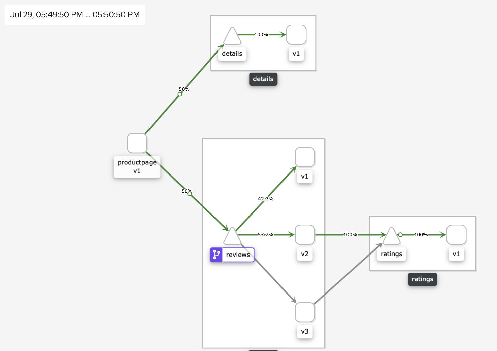

.. _control_application_traffic:

.. title:: Controlling Application Traffic using Virtual Service CDR

--------------------------------
Controlling Application Traffic
--------------------------------

In this section we will learn how to control application traffic to different versions of the Reviews application.

Scenario: Let’s say one day your management wants all traffic to go to v3of the Reviews app as it is the latest and testing has proven that it has worked properly. How would you do this?

We will attempt to redirect 100% of the incoming traffic to v3 pods here:

#. In Kiali, click on **Services** option and select **reviews** service.

   .. figure:: images/reviews-service.png

#. In the Services window select **Actions** (on top right-hand side) and click on **Create Weighted Routing**

   .. figure:: images/createweightedrouting.png

    You will be presented with a sliding-bar to move traffic

   .. figure:: images/reviews-beforeWeightedRouting.png

#. Since we would like all traffic (100%) to go to v3 pods, slide this to 100% as shown here and click **Create**

   .. figure:: images/reviews-afterWeightedRouting.png

#. Now go back to **Graph** section and observe traffic flow. You will be able to see all traffic is now routed to v3 of reviews pod over a period of time.

   .. figure:: images/reviews-100%TrafficV3.png

   Now the v1 and v2 pods can be easily de-commissioned if required. This is one example of application traffic management.

#. You might be wondering where Istio stores the configuration of the change you have made to redirect traffic to v3 pod. All this is done using a virtual service CDR

Exploring Virtual Service CRD
++++++++++++++++++++++++++++++

Let’s take a look at the virtual service configuration using Kiali and Kubectl commands so you know where the configurations are stored and what they look like.

#. In Kiali interface, select **Istio Config** section

#. Choose the **reviews** Virtual Service configuration corresponding to Virtual Service

   .. figure:: images/reviews-virtualService.png

#. Once the configuration page opens up, click on the YAML tab and you will see the traffic weighted routing rule implementation details. Note that all 100 percent of traffic is configured to go to v3 pod

   .. figure:: images/reviews-WeightedRouting.png

#. You are also able to see the virtual service using kubectl, in your shell try the following commands and check the configurations

   .. code-block:: bash

 	  k get VirtualService reviews -n xyz-ns -o yaml

#. You can either edit the YAML file in the Kiali GUI or using kubectl and apply it.

   .. figure:: images/reviews-weightedrule-YAML.png

Your Day in Life
+++++++++++++++++

As an administrator of this Service Mesh, you get an alert from the Developers that v3 of reviews application has a few bugs and not displaying properly for end-users. You are asked to redirect traffic back to v1 and v2 pods of the reviews section. How will you do this? Go ahead an give it a try.

Try modifying the configuration to route 50% traffic to v1 and 50% to v2.

Hint: Use the following command to change the weighted routing values to v1 and v2 pods.

.. code-block:: bash

 k edit VirtualService reviews -n xyz-ns

Once you done editing the Virtual Service, observe traffic flow in Kiali for more than a minute. You should see something like this.

