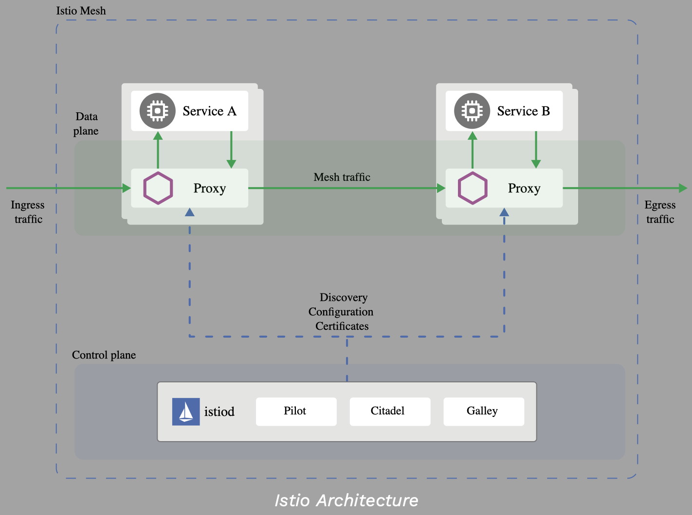

.. _istio:

-------------------------------
Istio Service Mesh
-------------------------------

Service mesh has become quite popular recently in monitoring and directing application traffic management using software. This applies to microservices to VM based workloads. In this bootcamp we will focusing on Service Mesh for microservices only.

*The term service mesh is used to describe the network of microservices that make up such applications and the interactions between them.*

**Source:** `Service Mesh <https://istio.io/latest/docs/concepts/what-is-istio/#what-is-a-service-mesh>`_

Service mesh offers fast, reliable and secure communications between microservices. Service mesh offers useful capabilities such as (not limited to):

- Load balancing (weighted)
- Traffic management
- Authentication and authorization
- Encryption
- Monitoring

Istio being one of the easy-to-implement and popular service mesh, has the support of major software vendors by implementing it in production environments. There are also other service mesh providers out there like Hashicorp, Buoyant, etc.

Istio Service Mesh Architecture
+++++++++++++++++++++++++++++++++

Istio Service Mesh has control and data planes.

- The control plane is used to manage the service mesh and
- The data plane collects and implements desired service mesh functionalities on the application

Istio Service Mesh control plane runs in its own kubernetes `namespace <https://kubernetes.io/docs/concepts/overview/working-with-objects/namespaces/>`_ called **istio-system** once installed on a kubernetes cluster of choice.

Service Mesh in Kubernetes
+++++++++++++++++++++++++++++++++

Istio Service Mesh functionality is implemented by deploying a proxy (side-car) container within an application pod in Kubernetes.

No application code is necessary for implementation of Istio Service Mesh. Application is just overlaid with Istio service mesh side-car container.

This side-car container serves as an entry and exit point of traffic to the application container. This is facilitated by the same network and storage made available to the side-car container as well.

Source and further Istio Architecture reference can be `here <https://istio.io/latest/docs/concepts/what-is-istio/>`_

Istio and CRD(s)
+++++++++++++++++

Istio is able to implement Service Mesh functionality by extending basic kubernetes functionality (services, etc) with Custom Resource Definitions (CRD). Some CRD are here (not limited to):

- `Virtual Service <https://istio.io/latest/docs/concepts/traffic-management/#virtual-services>`_
- `Destination Rules <https://istio.io/latest/docs/concepts/traffic-management/#virtual-services>`_
- `Service Entries <https://istio.io/latest/docs/concepts/traffic-management/#gateways>`_
- `Gateways <https://istio.io/latest/docs/concepts/traffic-management/#gateways>`_

.. note::

	In this lab we will be only working with Virtual Service CRD. Future version might bring additional labs to understand and try other CRD(s)

Istio and Kiali
+++++++++++++++++++++++++++++++++

Kiali is used as a visualisation layer for deployed applications.  Kiali also supports configuring traffic management policies amongst others. Kiali helps administrators visualise the following(not limited to):

- Applications and related microservices
- Performance patterns
- Operations
